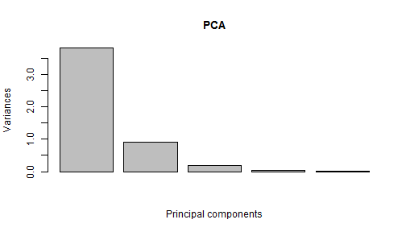
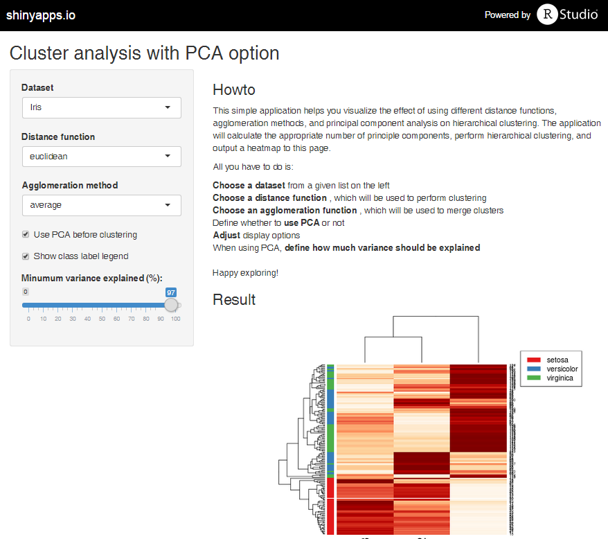

Principal Cluster Analysis
========================================================
transition: rotate
font-family: 'Helvetica'
## Easy Clustering and PCA Visualization

author: Dariusz Brzezinski
date: 20.05.2015

Why Cluster?
========================================================

In todays data-intensive world, it is often hard to judge which of the gathered information 
are the most important. Similarly, the amount of surrounding data makes it difficult to sort
information into cohesive groups, for more in-depth analysis.

Clustering is the task of grouping objects in such a way that objects in 
the same group (called a **cluster**) are more similar to each other then to those in other groups.

Thanks to clustering, the computer can group information for us **automatically**.

What is PCA?
========================================================
However, clustering on its own might not be enough, as some of the attributes describing
the analyzed objects only introduce noise. Luckily **Principal Component Analysis** (PCA) creates new attributes which combine the most important information. Using PCA, we can limit the number of attributes, while leaving important patterns.
***

```r
pc <- prcomp(
    data.matrix(iris),
    scale=TRUE)
plot(pc, xlab="Principal components", main="PCA")
```

 

The App
========================================================

***
The **Principal Cluster Analysis** (patent pending) lets you visualize the effect of
using different distance measures and clustering options, plus, it helps you assess
the influence of PCA on the clustering process!

Go ahead - try it!
========================================================

The author is aware that this pitch is not pitch perfect, but the presented
application might still be an interesting learning experience for the reader.
So judge it on your own, **try the app at**:

https://dabrze.shinyapps.io/ClusterAnalysis/
